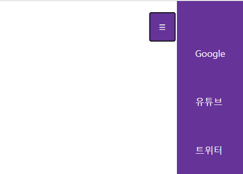

### hamburger 버튼

1. 버튼 -> 햄버거 icon
2. namv > li > a -> hidden
3. toggle on click
4. animation

#### 📝 알게 된 점
<pre><code> box-sizing: border-box; </code></pre>
>  요소의 너비와 높이를 계산하는 방법

 

<pre><code>list-style-type: none; /* 동그라미 없애기 */</code></pre>
>list-style-type : 리스트 스타일 지정

 

<pre><code>text-decoration: none; /* 밑줄 없애기 */</code></pre>
> text 꾸미기 지정

 

<pre><code>transform: translateX(-100px);</code></pre>
> 평면에서 움직이기

 
<pre><code>transition: transform 0.3s ease-in-out;</code></pre>
> 애니메이션 속도 조절

 
<pre><code>
btn.addEventListener("click", () => {
    nav.classList.toggle("active");
    btn.classList.toggle("active");
});
</code></pre>
> btn 클릭시 toggle이 active일때 적용